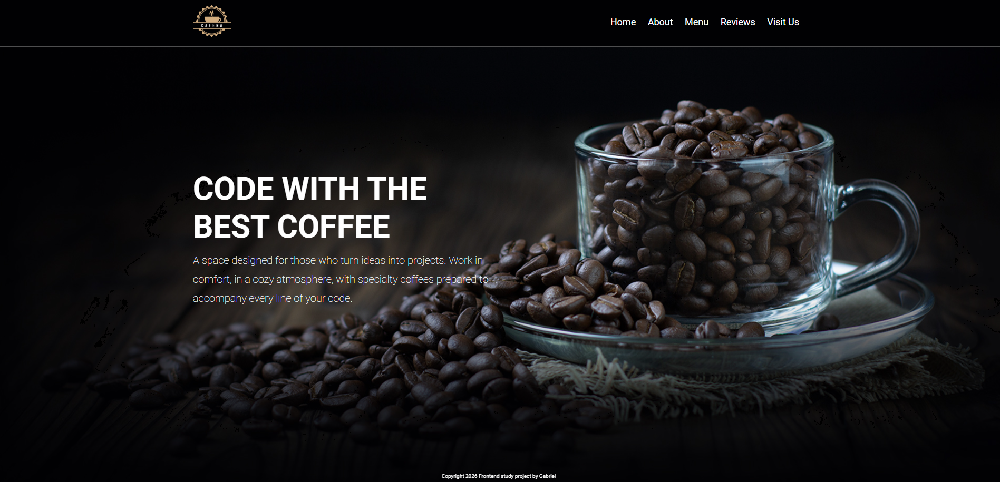
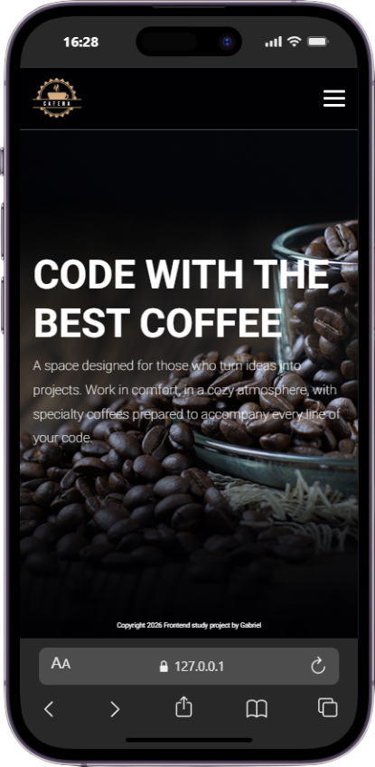

<h1 align="center" style="font-weight: bold;">☕ COFFE SHOP LANDING PAGE</h1>

<p align="center">
    <b>This project was developed to improve my front-end development skills, focusing on responsive layouts, user interface design, and JavaScript interactions. It is part of my personal portfolio and represents my continuous learning journey as a developer.</b>
</p>

<h2 id="layout">🎨 Layout</h2>

<p align="center">
    
</p>

<p align="center">
    
</p>

<h2 id="technologies">💻 Technologies</h2>

<p>
   HTML5
  <br>
   CSS3
  <br>
   JavaScript
</p>

<h2 id="features">✨ Features</h2>

<p>
    • Responsive design for mobile, tablet, and desktop</br>
    • Smooth scrolling navigation</br>
    • Interactive mobile menu</br>
    • Customer reviews section</br>
    • Animated interface elements</br>
    • Modern coffee shop UI design
</p>


<h2 id="started">🚀 Getting started</h2>

<h3>Prerequisites</h3>

The following tools are required to run the project locally:

- [Git](https://git-scm.com)
- [Any Modern Web Browser](https://www.google.com/intl/pt-BR/chrome/)

<h3>Cloning</h3>

```bash
git clone https://github.com/gabrielolivete/coffee-shop-pjt.git
```

<h3>Starting</h3>

```bash
cd coffee-shop-pjt
```
Use the VS Code Live Server extension for a better development experience.

</br>
</br>

<p>
     <a href="https://gabrielolivete.github.io/coffee-shop-pjt/">📱 Visit this Project</a>
</p>

</br>
</br>

<h2 id="learn">💾 What I Learned</h2>

- Improved responsive design skills
- Practiced DOM manipulation with JavaScript
- Learned how to create mobile-friendly navigation
- Enhanced UI/UX design principles

<hr>

<p align="center">
Built with ☕ and code by Gabriel Olivete
</p>
